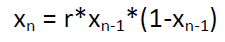
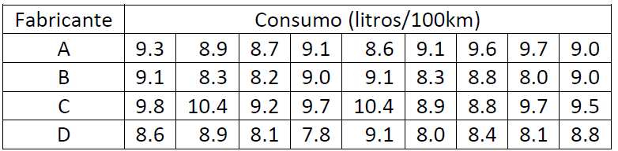

```{r setup, include=FALSE}
knitr::opts_chunk$set(echo = TRUE,warning = FALSE, message = FALSE)
  
```
### Materia: Entornos de computacion estadística
### Autor: Francisco Márquez
### contacto: franmarq@gmail.com


### **Ejercicio 1**

Imaginemos la siguiente situación: un jugador tiene un capital de 20 euros y cada instante de tiempo apuesta un euro al lanzamiento de una moneda, ganando un euro si sale cara y perdiendo el euro apostado si sale cruz. Consideramos la variable aleatoria discreta T que nos indica el instante de tiempo en que el jugador se arruina por primera vez (obsérvese que esta variable en principio podría tomar un valor infinito si jamás se llegara a la ruina). Crear una función en R que permita simular y representar gráficamente la “ruina del jugador”. En la creación de la función tendremos en cuenta lo siguiente:

Tendrá un único argumento que es el capital inicial. En el caso descrito antes es de 20 euros aunque admitiremos que este puede ser otro valor.

* La moneda se supone no trucada (probabilidad de cara y cruz es la misma, ½).
* El juego termina en el instante en que el capital de que dispone el jugador es 0 (ruina).
* La función debe devolver los resultados en un gráfico cuyo formato y apariencia será similar al de los ejemplos mostrados a continuación:


Estos gráficos representan dos realizaciones del experimento. En el gráfico de la izquierda el jugador se arruina en el instante 554 y en de la derecha en el instante 1262.

### *SOLUCION*

Con base en las indicaciones se crea la función quiebra cuya sintaxis en R es la siguiente:


```{r quiebra}
### Se crea la funcion *quiebra* con base en lo indicado

quiebra = function (capital,prob_cara) {
  p=prob_cara
  q=1-p
  vector <- c(capital)
  while (capital>0) {
    Resultado <- sample(c(-1,1), size=1, prob=c(p,q))
    capital <- c(capital+Resultado)
    vector <- append(vector, c(capital))
  }
  ### Creamos el gráfico de linea con el capital resultante en cada iteracion
  
  plot(ts(vector),xlab='Ensayos',ylab='Capital')
  abline(h=50,col='black',lty=2)
  length(vector) 
}


### Para ejecutar la función corremos la siguiente función:

quiebra(20,0.5)

```

El resultado anterior, muestra el comportamiento del capital durante n susesivas ejecuciones de la función quiebra con base en los parámetros indicados. Finaliza cuando el capital llega a Cero. Una repetición del experimento puede producir una resultado diferente en cuanto a número de iteraciones para alcanzar la condición de quiebra.


### **Ejercicio 2**

Crear una función con nombre “dif.eq” que devuelva el vector (x1,x2,…,xn) donde: 



La función tendrá tres argumentos: “x1”, que corresponde al primer elemento x1, el coeficiente “r” y el número de iteraciones en la serie “n”.

* Ejecutar la función para r = 2 y 0 < x1 <1. Se debería obtener que xn tiende a 0.5 cuando n tiende a infinito.
* Representar gráficamente la serie obtenida con x1 = 0.95, r = 2.99 y n = 500.
* Escribir una segunda función “dif.eq2” con argumentos “x1” y “r” que devuelva el número de iteraciones (n) necesarias para alcanzar el criterio de convergencia siguiente: |xn - xn-1|<0.02. Para x1=0.95 y r =2.99 la respuesta es 84.

### *SOLUCION*

Primero creamos la función dif.eq de acuerdo a la siguiente sintaxis

```{r difeq}
dif.eq <- function(x1,r,n) {

  vector2<- c(x1)
  
  for (i in 2:n) {
    calc <- r*vector2[i-1]*(1-vector2[i-1])
    vector2<- append(vector2,c(calc)) 
  }  
  plot(ts(vector2),xlab='Iteraccion',ylab='Resultado')
  abline(col='black')
  length(vector2) 
}
```

La particularidad de la función es que x1 es un parámtro por lo que la iteracción inicia a partir de i=2. 

Para ver la tendencia de xn a 0.5 ejecutamos la función con los siguientes parámetros:

```{r }
dif.eq(0.95,2,10)
```
Se puede observar rapidamente la tendencia a 0.5.

Luego, ejecutamos la siguiente función para ver su represntación gráfica: 

```{r}
dif.eq(0.95,2.99,500)
```
Por último, construimos dif.eq2 para conocer el número de iteraciones requeridas para alcanzar el criterio de convergencia |xn - xn-1|<0.02.

```{r}
dif.eq2 <- function(x1,r) {
  
  vector3<- c(x1)
  i=1

  repeat {
  i<- i+1
  calc2 <- r*vector3[i-1]*(1-vector3[i-1])
  vector3<- append(vector3,c(calc2)) 
  a<- vector3[i-1]
  b<- vector3[i]
#  print(i)
#  print(vector3)
#  print(a)
#  print(b)
  if (abs(b-a) < 0.02 ) {
    print(i-1)
    break
  }
  }
}
```

comprobamos que con el resultado sea 84 cuando los parametros son: x1=0.95 y r =2.99

```{r valida1}
dif.eq2(0.95,2.99)
```


### **Ejercicio 3.** 
El conjunto de datos cars, contenido en el libro datasets de R, recoge información acerca de la velocidad de los coches (variable speed) y distancias necesarias para parar (variable dist). Utilizando dichos datos realizar un análisis descriptivo básico de las variables contenidas en él, ofreciendo la siguiente información:

* Para cada variable: medidas de posición central, dispersión, asimetría y curtosis; gráficos exploratorios adecuados para el tipo de datos.
* Considerando conjuntamente las dos variables speed y dist: construir un diagrama de dispersión, calcular la recta de regresión que permita explicar dist en función de speed y superponerla en el diagrama de dispersión. Cuantificar la bondad del ajuste lineal a través del coeficiente de determinación.

### *SOLUCION*

#### *Parte a)*

Para facilitar el entendimiento y manejo de los datos, primero examinamos la estructura y visualizamos los primeros registros del conjunto:

```{r}
str(cars) #estructura
head(cars) #Primeros registro
```
En primer lugar, se habilitan las librerias que serán usadas

```{r}
library(Hmisc)
library(lattice)
library(survival)
library(Formula)
library(ggplot2)
library(dplyr)
library(modeest)  # Para hallar la moda
library(moments)  # Para hallar las medidas de forma
library(GGally)
```
Luego obtenemos algunos valores descriptivos de las variables como medidas de tendencia central, asimetria y Curtosis 

```{r}
### posición central

summary(cars)   # posicion, media, madiana
mfv(cars$speed) # Moda
mfv(cars$dist)  # Moda

### dispersión

var(cars$speed) # Varianza
sd(cars$speed)  # Desviacion estandar

#CV(cars$speed)

### asimetría y curtosis
skewness(cars$speed)    # Sesgo
kurtosis(cars$speed)    # Curtosis


```
y a continuacion generamos los gráficos considerados para cada variable, el siguiente gráfico genera una recomendacion gráfica de acuerdo a los tipos de variable, en nuestro caso en forma cruzada generar el gráfico de dispersión y el coeficiente d correlación que sugiere una relación lineal entre velocidad y distancia e individualmente muestra el comportamiento d ela distribución.

```{r}

ggpairs(cars)
```

en los siguients graficos, generamos tanto los histogramas como los respectivos graficos de caja. lo que no ayuda a examinar mejor el comportamiento de ambas variables.

```{r}

# Generamos los graficos en cada variable
par(mfrow = c(2, 2))
hist(cars$speed, col = "orange")
hist(cars$dist, col = "green")
boxplot(cars$speed, col = "orange",xlab = "Data:Cars$Speed",ylab = "Speed")  
boxplot(cars$dist, col = "green",xlab = "Data:Cars$Dist",ylab = "Distance")  
par(mfrow = c(1, 1))
```

#### *Parte b)*

Se construye diagrama de dispersión con recta de regresión proyectada sobre el mismo:

```{r}
attach(cars)
Modelo<- lm(dist~speed)
summary(Modelo)


plot(speed,dist,
     xlab = "Speed",ylab="Distance") 
abline(Modelo, col="red")
```

al obtener el resultado del analisis de regresión, podemos validar que el Coeficiente de Determinación resulto en 0.65, este resultado indica que se puede esperar una asociación lineal entre la distancia y la velocidad. En otras palabras, la variacion total de la distancia (y) puede ser en parte explicada por el modelo de regresión lineal que incluye la velocidad(x): y=3.93x-17.5


### **Ejercicio 4.** 
Consideremos los siguientes datos del calor latente en la fusión del hielo expresados en cal/gm:

Muestra A: 79.98 80.04 80.02 80.04 80.03 80.03 80.04 79.97 80.05 80.03 80.02 80.00 80.02
Muestra B: 80.02 79.94 79.98 79.97 79.97 80.03 79.95 79.97

* Construir un gráfico de cajas y un gráfico cuantil-cuantil para comparar la distribución de cada muestra.
* Contrastar la igualdad de varianzas de las distribuciones de dichas muestras.
* Contrastar la igualdad de medias de las distribuciones de dichas muestras.

Primero creamos el conjunto de datos para su procesamiento

```{r}
### construccion de los datos

Muestraa<- c(79.98,80.04,80.02,80.04,80.03,80.03,80.04,79.97,80.05,80.03,80.02,80.00,80.02)
Muestrab<- c(80.02,79.94,79.98,79.97,79.97,80.03,79.95,79.97)
### compleamos los datos faltantes con 'NA'
max.len = max(length(Muestraa), length(Muestrab))
Muestrab = c(Muestrab, rep(NA, max.len - length(Muestrab)))
### describnimos el conjunto
head(Muestrab)
dim(Muestraa)
dim(Muestrab)
### creamos y describimos el conjunto de datos ejer3.data
ejer3.data<- data.frame(Muestraa,Muestrab)
head(ejer3.data,13)
dim(ejer3.data)
``` 

#### *Parte a)*

Se Generan los gráficos de cajas, con todos los valores

```{r}

### 4.a
par(mfrow=c(1,1))
boxplot(ejer3.data)
```
Se imputan los valores faltantes con el valor de la media del conjunto para poder obtener el gráco cuantil-cuantil (por la naturaleza de los datos son posibles soluciones mpas adecuadas a la imputación).

```{r}
#### se imputan valores NA con la media
ejer3.data$Muestrab [ is.na (ejer3.data$Muestrab)] <- mean (ejer3.data$Muestrab, na.rm = TRUE )
head(ejer3.data,13)

#### data[complete.cases(ejer3.data)]
qqplot(ejer3.data$Muestraa,ejer3.data$Muestrab)

```

#### *Parte b)*
Se procede a contrastar la igualdad de varianzas de las distribuciones de dichas muestras

```{r}
var.test(ejer3.data$Muestraa, ejer3.data$Muestrab)
```

Con base en el valor **p** obtenido (0.99), no hay suficiente evidencia para rechazar la hipótesis de que las varianzasde los valores del calor latente en la fusión del hielo expresados en cal/gm en ambas muestras son iguales.

#### *Parte c)*
Se procede a contrastar la igualdad de medias de las distribuciones de dichas muestras.
```{r}
t.test(ejer3.data$Muestraa, ejer3.data$Muestrab)
```
Con base en el valor **p** obtenido (0.00015), podemos concluir que las medias de los vaolores del calor latente en la fusión del hielo expresados en cal/gm en ambas muestras son diferentes.


### **Ejercicio 5.** 

Los siguientes datos corresponden a un estudio sobre el consumo de combustible de cuatro fabricantes diferentes de vehículos de motor 1600cc.


En la tabla se recogen datos de consumo de combustible (litros/100km) para muestras independientes de 9 vehículos nuevos de cada fabricantes, después de recorrer la misma ruta en idénticas condiciones y con el mismo conductor.
* Construir un gráfico exploratorio de cajas que permita la comparación de los cuatro fabricantes.
* Realizar un contraste de hipótesis apropiado que permita concluir si hay o no diferencia significativa entre los fabricantes respecto al consumo de combustible.
* Justificar las hipótesis asumidas en el contraste de hipótesis realizado en el apartado b).

En primer lugar creamos y revisamos el conjunto de datos:


```{r}
### Datos Fabricante Consumo (litros/100km)

A<- c(9.3
,8.9
,8.7
,9.1
,8.6
,9.1
,9.6
,9.7
,9.0)

B<- c(9.1
,8.3
,8.2
,9.0
,9.1
,8.3
,8.8
,8.0
,9.0)

C<- c(9.8
,10.4
,9.2
,9.7
,10.4
,8.9
,8.8
,9.7
,9.5)

D<- c(8.6
,8.9
,8.1
,7.8
,9.1
,8.0
,8.4
,8.1
,8.8)

ejer5.data<- data.frame(A,B,C,D)
head(ejer5.data,9)
```

#### *Parte a) comparación de los cuatro fabricantes.*

```{r}
par(mfrow = c(1, 1))
boxplot(ejer5.data, col = ncol(ejer5.data))
``` 

#### *Parte b) Contraste de hipótesis para saber si hay o no diferencia significativa entre los fabricantes respecto al consumo de combustible*

El test seleccionado es el ANOVA, para poder ejecutar el mismo debemos cambiar la forma como está organizada la data de tabular a columnar. 

```{r}
### Data para ejecuci[on de los test
ejer5.data2<- stack(ejer5.data)
head(ejer5.data2)
### b) Realizar un contraste de hipótesis apropiado que permita concluir si hay o no diferencia significativa entre los fabricantes respecto al consumo de combustible.
anova <- aov(values ~ ind, data = ejer5.data2)
summary(anova)

plot(anova)
```
Dado que el p-value no es superior a 0.05, hay evidencias suficientes para considerar que al menos dos medias entre los fabricantes respecto al consumo de combustible son distintas. La representación gráfica de los residuos no muestra falta de homocedasticidad (gráfico 1) y en el qqplot los residuos se distribuyen muy cercanos a la linea de la normal (gráfico 2).

#### *Parte c) Justificar las hipótesis asumidas en el contraste de hipótesis realizado en el apartado b).*
